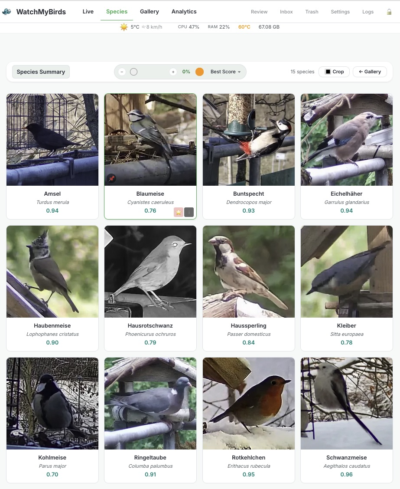
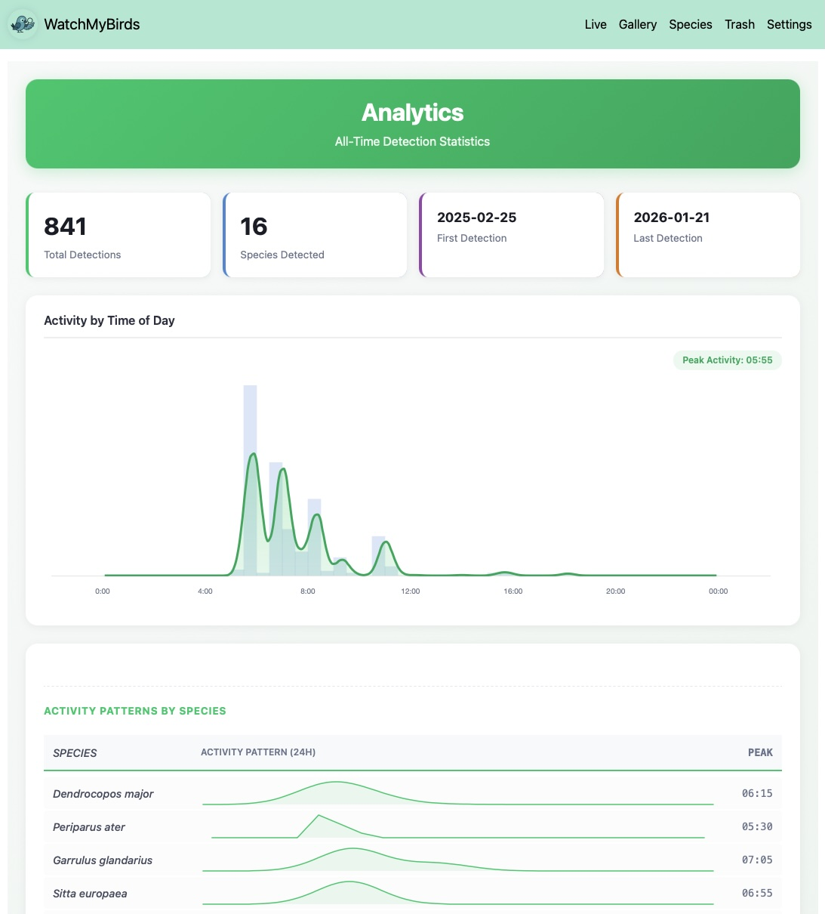

# WatchMyBirds
Real-time visual monitoring with AI-based detection and classification

[](https://github.com/arminfabritzek/WatchMyBirds/actions/workflows/docker.yml) 

**WatchMyBirds** is a self-hosted system for real-time object detection and classification from live camera streams.
It is designed for long-running operation, reproducibility, and controlled data ingestion in ecological, research, and hobbyist monitoring setups.

The project focuses on **robust pipelines**, **explicit lifecycle control**, and **predictable behavior** rather than experimental features.

---

## Project Status

WatchMyBirds is under active development with a stable core architecture.

- The core pipeline and data model are stable.
- Configuration and UI features may evolve.
- Backward compatibility of stored data is not guaranteed across major versions.

This repository represents the current baseline implementation of the v0.x series.

For long-running setups, pin Docker image versions and keep backups of the `output` directory.

---

## Species Overview
Representative detections per species with highest-confidence observations.



## Analytics
Aggregated activity patterns and long-term detection statistics.



---

## Quickstart
The fastest way to get WatchMyBirds running is via Docker Compose:

```bash
git clone https://github.com/arminfabritzek/WatchMyBirds.git
cd WatchMyBirds
cp docker-compose.example.yml docker-compose.yml
docker-compose up -d
```

---

## Overview

WatchMyBirds processes continuous video streams (USB, RTSP, HTTP)
and applies a two-stage AI pipeline to selectively persist relevant frames.

Key design goals:
- Deterministic ingestion and storage
- Clear separation between capture, detection, and UI
- Reproducible model usage
- Minimal operational surprises

The system runs fully containerized and is suitable for NAS systems, small servers, and development machines.


---

## Key Features

- **Real-time detection from live streams**  
  USB, RTSP, and HTTP sources; tested with IP and PTZ cameras.

- **Two-stage AI pipeline**  
  Object detection with downstream classification (e.g. YOLO, EfficientNet).

- **Robust capture and ingest pipeline**  
  Explicit lifecycle control, resilient FFmpeg handling, and reproducible storage.

- **Fast, responsive web interface**  
  Immediate startup with asynchronous stream status and lazy-loaded views.

- **Hardware-agnostic deployment**  
  Docker-based setup for NAS systems, servers, and development machines.

- **Integrated notifications**  
  Optional Telegram alerts for detection events.

---

## Configuration Highlights
- Configuration is loaded once at startup and shared across modules.
- Detection results are persisted in SQLite (images.db) with full model provenance.
- Runtime-editable settings are separated from boot-time infrastructure configuration.

---

## Configuration Reference (.env / docker-compose)
Set these as environment variables in your .env file or in docker-compose.


| Setting | Default | Description |
| --- | --- | --- |
| `DEBUG_MODE` | `False` | Enable verbose logging and debug behavior. |
| `OUTPUT_DIR` | `/output` | Base directory for images and `images.db`. |
| `INGEST_DIR` | `/ingest` | Directory for bulk image ingestion. |
| `VIDEO_SOURCE` | `0` | Camera source (int for webcam, string for RTSP/HTTP). |
| `LOCATION_DATA` | `52.516, 13.377` | GPS lat/lon for EXIF (`"lat, lon"`). |
| `CONFIDENCE_THRESHOLD_DETECTION` | `0.55` | Detector confidence threshold for display logic. |
| `DETECTION_INTERVAL_SECONDS` | `2.0` | Pause between detection cycles (seconds). |
| `MODEL_BASE_PATH` | `/models` | Base directory for model files. |
| `CLASSIFIER_CONFIDENCE_THRESHOLD` | `0.55` | Classifier confidence threshold for gallery summaries. |
| `STREAM_FPS_CAPTURE` | `0` | Capture throttle (0 disables throttling). |
| `STREAM_FPS` | `0` | UI MJPEG feed throttle (0 disables throttling). |
| `STREAM_WIDTH_OUTPUT_RESIZE` | `640` | Width for the live stream preview in the UI. |
| `DAY_AND_NIGHT_CAPTURE` | `True` | Enable daylight gating for detections. |
| `DAY_AND_NIGHT_CAPTURE_LOCATION` | `Berlin` | City name for Astral daylight check. |
| `CPU_LIMIT` | `1` | CPU affinity cap (<=0 disables affinity). |
| `TELEGRAM_COOLDOWN` | `5` | Cooldown (seconds) between Telegram alerts. |
| `TELEGRAM_ENABLED` | `False` | Enables/disables Telegram sends (tokens remain env-only). |
| `EDIT_PASSWORD` | `SECRET_PASSWORD` | Password for edit page access in the UI. |

---

### Important Notes: Trigger Logic & Ingest

**A. Ingest vs. Live Operation**
- In **Live Mode**, the system only saves images where a valid object detection occurs (filtered by `SAVE_THRESHOLD`).
- The **Ingest Tool** (manual upload) behaves differently: it saves **every image** to the database, even if no objects are detected. This is by design to ensure **hash idempotency** (preventing re-ingest loops) and reproducibility. Do not expect the Ingest behavior to match Live filtering exactly.

**B. Detection Thresholds**
- `CONFIDENCE_THRESHOLD_DETECTION`: Used by the AI model to filter candidate boxes.
- `SAVE_THRESHOLD`: Used by the system to decide if an image should be saved.
- **Rule:** Ensure `CONFIDENCE_THRESHOLD_DETECTION <= SAVE_THRESHOLD`. If the detection threshold is higher than the save threshold, the model will filter out candidates before the system can evaluate them for saving.

---

## Configuration Model (Boot vs Runtime)
The app uses two layers of configuration:

**Boot / Infrastructure (read-only at runtime)**  
Loaded once from `.env`/Docker and shown as read-only in the UI. Changes require a restart.

**Runtime Settings (UI-editable)**  
Stored in `OUTPUT_DIR/settings.yaml`, applied without changing startup semantics.

Merge order:
```
defaults → env → settings.yaml
```

Runtime edits update `settings.yaml` only (no `.env` mutation).

---

## Tested Cameras

| Hardware | Protocol |
| :--- | :--- |
| Low-cost PTZ camera | RTSP |
| Raspberry Pi Camera | HTTP (MotionEye OS) |

---

## Share Your Results
If you use WatchMyBirds in a research, monitoring, or hobbyist context,
feel free to share insights or feedback via GitHub issues.

Your contributions help improve **WatchMyBirds** for everyone!

---

## Roadmap

### Model & Detection Quality
- Improve detection and classification accuracy
- Support additional model architectures and domain-specific datasets

### Performance & Deployment
- Optimize runtime performance for low-power and edge devices
- Improve scalability across heterogeneous hardware setups

### Analysis & Insights
- Aggregate temporal and spatial activity patterns
- Provide exploratory analytics and summary views

### Usability & Configuration
- Refine configuration workflows and runtime settings
- Improve long-running stability and observability

---

## Installation and Setup

### Manual Setup (Without Docker)

For development or local testing:

```
python -m venv venv
source venv/bin/activate
pip install -r requirements.txt
python main.py
```

The web interface will be available at http://localhost:8050.

---

## Contributing

Have ideas or improvements? Open an issue or submit a pull request!

Issues and pull requests are welcome.

Please keep changes focused and well-scoped.
---

## Acknowledgements

This project uses **Label Studio** – provided free through the Academic Program by HumanSignal, Inc.  
[](https://labelstud.io)

---

## License
This project is licensed under the Apache-2.0 License. See the [`LICENSE`](LICENSE) file for details.