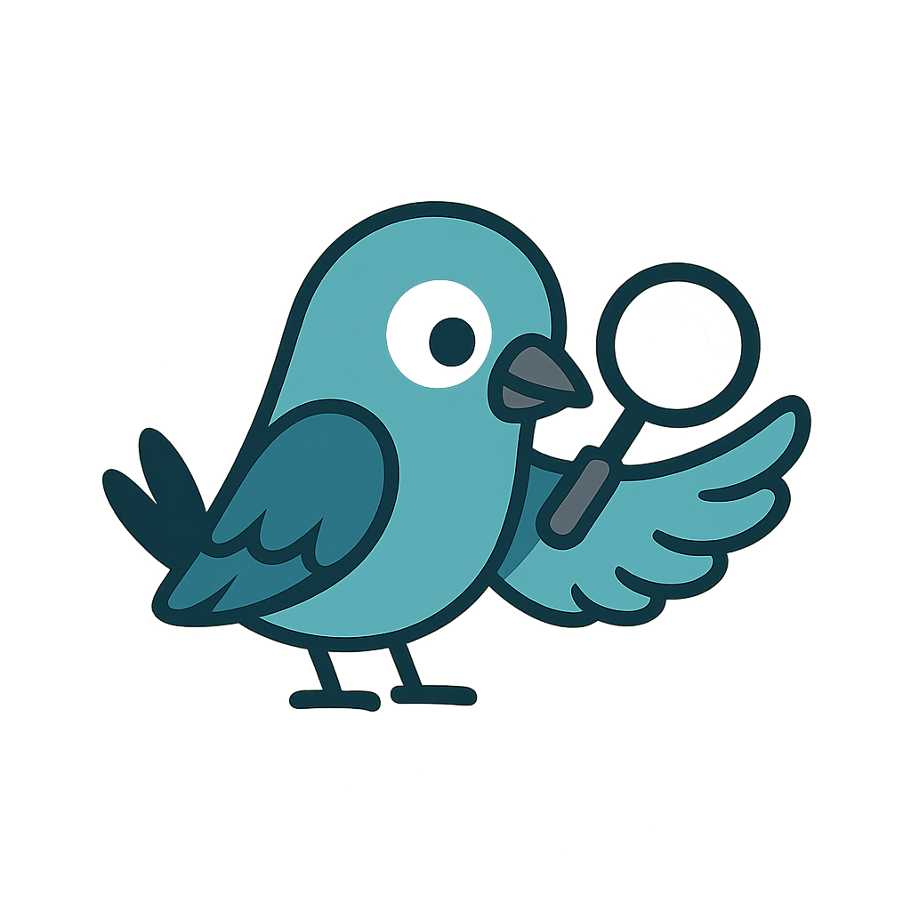

<p align="center">
  
</p>

<h1 align="center">WatchMyBirds</h1>

<p align="center">
  <strong>AI-powered bird detection and classification from live camera streams</strong>
</p>

<p align="center">
  <a href="#quickstart">Quickstart</a> •
  <a href="#documentation">Documentation</a> •
  <a href="#raspberry-pi-appliance">RPi Appliance</a> •
  <a href="#contributing">Contributing</a>
</p>

<p align="center">
  <a href="https://github.com/arminfabritzek/WatchMyBirds/actions/workflows/docker.yml"></a>
  <a href="https://github.com/arminfabritzek/WatchMyBirds/releases"></a>
  
  
  <a href="https://github.com/sponsors/arminfabritzek"></a>
</p>

---

<p align="center">
  
</p>

---

## Highlights

- 🎯 **Real-time detection** — Two-stage AI pipeline (detection + classification)
- 📊 **Analytics dashboard** — Activity patterns, species statistics, temporal insights
- 🍓 **Raspberry Pi ready** — Pre-built appliance images with WiFi setup
- 🐳 **Docker support** — One-command deployment on any server
- 🔒 **Hardened by default** — Systemd sandboxing, session auth, no root required

---

## Requirements

- Python 3.11+ or Docker 20.10+
- 2GB RAM minimum (4GB recommended for RPi)
- USB webcam or IP camera (RTSP/HTTP)

---

## Quickstart

### Docker (Recommended)

```bash
git clone https://github.com/arminfabritzek/WatchMyBirds.git
cd WatchMyBirds
cp docker-compose.example.yml docker-compose.yml
docker-compose up -d
```

### Local Development

```bash
python -m venv venv && source venv/bin/activate
pip install -r requirements.txt
python main.py
```

App available at: **http://localhost:8050**

---

## Screenshots

| Species Overview | Analytics Dashboard |
|------------------|---------------------|
|  |  |

---

## Documentation

| Document | Description |
|----------|-------------|
| [Architecture](docs/ARCHITECTURE.md) | System design and data flow |
| [Invariants](docs/INVARIANTS.md) | Core rules that must never be violated |
| [Security Policy](SECURITY.md) | Hardening measures and vulnerability reporting |
| [RPi Setup](rpi/README.md) | Raspberry Pi appliance guide |
| [Configuration](docs/CONFIGURATION.md) | All settings explained |

---

## Raspberry Pi Appliance

WatchMyBirds runs as a standalone appliance on Raspberry Pi with pre-built OS images.

### First Boot

1. Flash the image to SD card (use [Raspberry Pi Imager](https://www.raspberrypi.com/software/))
2. Boot the Pi — it creates an Access Point if no WiFi is configured:
   - **SSID:** `WatchMyBirds-XXXX`
   - **Password:** `watchmybirds`
3. Connect to AP and open **http://192.168.4.1:8050/setup**
4. Enter your WiFi credentials — device reboots into client mode
5. Access at **http://watchmybirds.local:8050**

> ⚠️ **Change the default password immediately after first login!**

See [rpi/README.md](rpi/README.md) for detailed setup instructions.

---

## Configuration

Configuration is loaded from environment variables and `settings.yaml`:

| Variable | Default | Description |
|----------|---------|-------------|
| `VIDEO_SOURCE` | `0` | Camera source (int for USB, string for RTSP) |
| `OUTPUT_DIR` | `/output` | Storage for images and database |
| `EDIT_PASSWORD` | `watchmybirds` | UI authentication password |
| `DETECTION_INTERVAL_SECONDS` | `2.0` | Pause between detection cycles |

Full reference: [docs/CONFIGURATION.md](docs/CONFIGURATION.md)

---

## Contributing

Contributions are welcome! Please:

1. Open an issue to discuss major changes
2. Keep pull requests focused and well-scoped
3. Follow existing code style

---

## Acknowledgements

This project uses **Label Studio** — provided free through the Academic Program by HumanSignal, Inc.

[](https://labelstud.io)

---

## License

This project is licensed under the **Apache-2.0 License**. See [LICENSE](LICENSE) for details.

Detection models are obtained at runtime and licensed separately by their respective authors.
