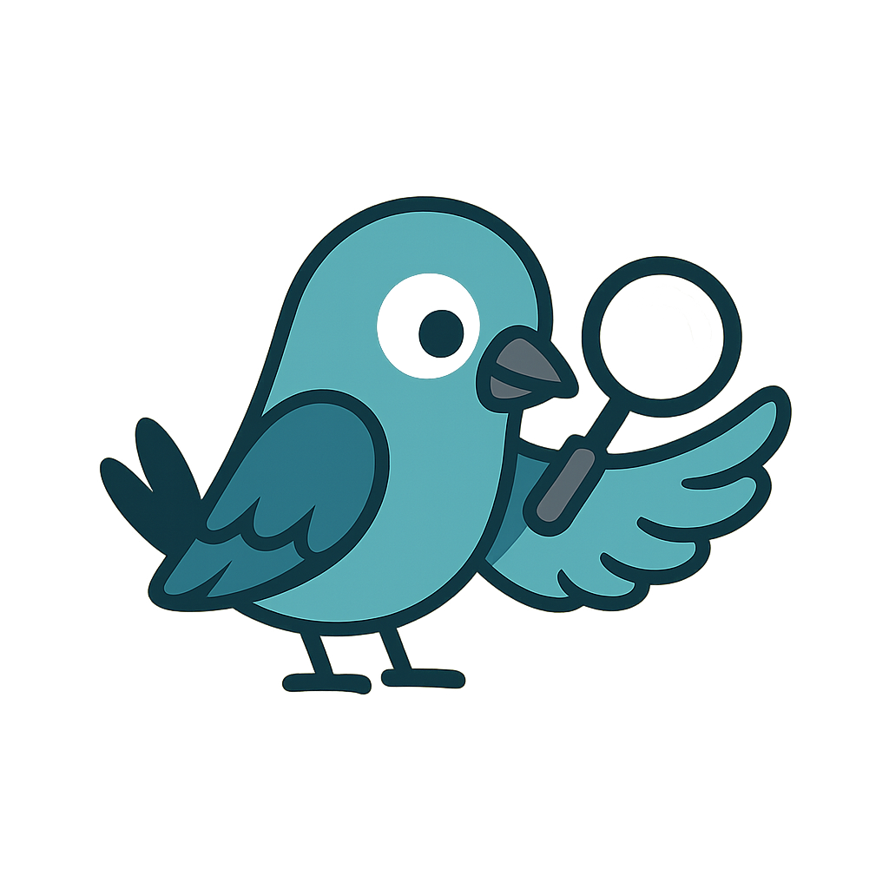
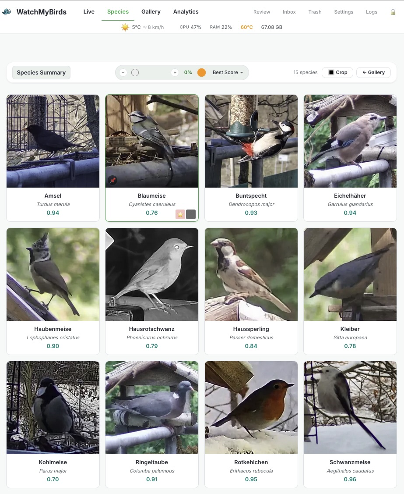
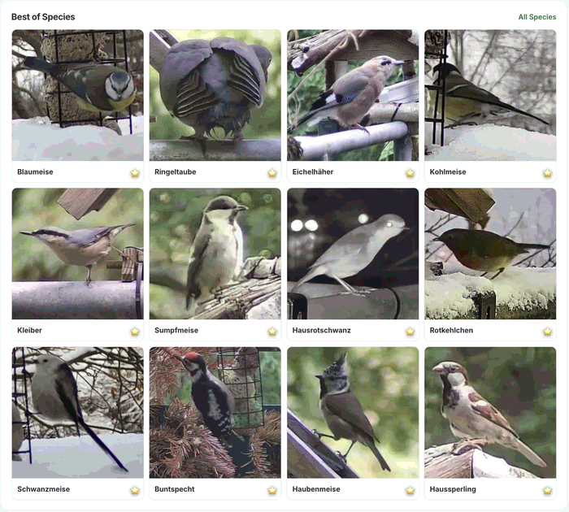
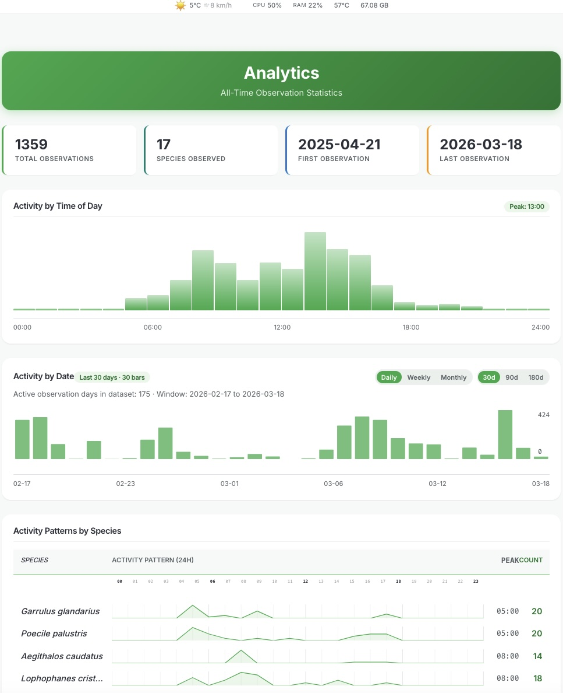

<p align="center">
  
</p>

<h1 align="center">WatchMyBirds</h1>

<p align="center">
  <strong>AI-powered bird detection and classification from live camera streams</strong>
</p>

<p align="center">
  <a href="#quickstart">Quickstart</a> •
  <a href="#documentation">Documentation</a> •
  <a href="#raspberry-pi-appliance">RPi Appliance</a> •
  <a href="#contributing">Contributing</a>
</p>


---

<p align="center">
  <!-- CI Status -->
  <a href="https://github.com/arminfabritzek/WatchMyBirds/releases">
    
  </a> <!-- Raspberry Pi -->
  <a href="https://github.com/arminfabritzek/WatchMyBirds/releases">
    
  </a>   <!-- Python -->
    <!-- License -->
    <!-- Sponsor -->
  <a href="https://github.com/sponsors/arminfabritzek">
    
  </a>
</p>

---

<p align="center">
  
</p>

---

## Highlights

- 🎯 **Real-time detection** — Multi-stage AI pipeline (detection + classification)
- 📊 **Analytics dashboard** — Activity patterns, species statistics, temporal insights
- 🍓 **Raspberry Pi ready** — Pre-built images with WiFi setup
- 🐳 **Docker support** — One-command deployment on any server
- 🔒 **Hardened by default** — Systemd sandboxing, session auth, no root required

---

## Features

- ⭐ **Favorites & cover images** — Mark your best shots as favorites; they become species cover images
- 📹 **Live stream** — Low-latency WebRTC live view via go2rtc relay with multi-viewer support
- 📖 **Species encyclopedia** — Wikipedia descriptions for every detected species
- ✅ **Review queue** — Triage new detections — keep, reclassify, or trash in one swipe
- 🗑️ **Trash & restore** — Soft-delete with easy restore — nothing lost by accident
- 🎥 **ONVIF discovery & PTZ control** — Implements ONVIF-based IP camera discovery and PTZ control from the UI

---

<p align="center">
  
</p>

---

## Requirements

- Python 3.12+ or Docker 20.10+
- Raspberry Pi 4 or 5 with 4 GB RAM minimum
- USB webcam or IP camera (RTSP/HTTP)

---

## Quickstart

### Docker (Recommended)

```bash
git clone https://github.com/arminfabritzek/WatchMyBirds.git
cd WatchMyBirds
cp docker-compose.example.yml docker-compose.yml
docker-compose up -d
```

> **Streaming default:** The Docker stack starts **WatchMyBirds + go2rtc** together using host networking for WebRTC compatibility.
> Set only `CAMERA_URL`; the app resolves relay/direct mode automatically.
> Replace `EDIT_PASSWORD` with your own value before first start, and leave `TELEGRAM_ENABLED=False` unless you also set real Telegram credentials.
> `go2rtc.yaml` is synchronized in the mounted output folder (`/output/go2rtc.yaml` in app, `/config/go2rtc.yaml` in go2rtc).
> Bridge networking is also supported — the app will automatically fall back to ffmpeg-based streaming if WebRTC is unavailable. See `docker-compose.example.yml` for details.

### Local Development

```bash
python -m venv venv && source venv/bin/activate
pip install -r requirements.txt
python main.py
```

Recommended local/runtime target: **Python 3.12**. The Raspberry Pi pipeline now starts from a Trixie Lite golden image and bakes CPython 3.12 into that shared base once before downstream image builds create the app virtualenv.

App available at: **http://localhost:8050**

---

## Screenshots

| Analytics Dashboard |
|---------------------|
|  |

---

## Documentation

| Document | Description |
|----------|-------------|
| [Architecture](docs/ARCHITECTURE.md) | System design and data flow |
| [Invariants](docs/INVARIANTS.md) | Core rules that must never be violated |
| [Security Policy](SECURITY.md) | Hardening measures and vulnerability reporting |
| [RPi Setup](rpi/README.md) | Raspberry Pi appliance guide |
| [Configuration](docs/CONFIGURATION.md) | All settings explained |

---

## Raspberry Pi Appliance

WatchMyBirds runs as a standalone appliance on Raspberry Pi with pre-built OS images.

### First Boot

1. Flash the image to SD card (use [Raspberry Pi Imager](https://www.raspberrypi.com/software/))
2. Boot the Pi — it creates an Access Point if no WiFi is configured:
   - **SSID:** `WatchMyBirds-XXXX`
   - **Password:** `watchmybirds`
3. Connect to AP and open **http://192.168.4.1:8050/setup**
4. Enter your WiFi credentials and choose an admin password for protected pages
5. Device reboots into client mode
6. Access at **http://watchmybirds.local:8050**

> Public pages stay available without login. Settings, review, delete, and other protected actions use the admin password you set during first setup.

See [rpi/README.md](rpi/README.md) for detailed setup instructions.

### Performance

Measured with a 2560 x 1920 RTSP stream. Times vary with resolution, scene complexity, and number of detected birds.

| | Detection | Classification (per bird) | Full cycle (1 bird) |
|---|---|---|---|
| **Raspberry Pi 5** (8 GB) | ~450–500 ms | ~300–400 ms | ~1.5–2.0 s |
| **Raspberry Pi 4** (4 GB) | ~1.9–2.0 s | ~1.5–1.9 s | ~3.5–5.0 s |

> 💡 Classification time scales linearly with the number of birds in the frame. A scene with 10 birds on an RPi 5 takes ~3–5 s total.

---

## Configuration

Configuration is loaded from environment variables and `settings.yaml`:

| Variable | Default | Description |
|----------|---------|-------------|
| `CAMERA_URL` | `""` | User-facing camera RTSP/HTTP URL |
| `STREAM_SOURCE_MODE` | `auto` | Source policy: `auto`, `relay`, `direct` |
| `OUTPUT_DIR` | `/output` | Storage for images and database |
| `EDIT_PASSWORD` | `watchmybirds` | UI authentication password; Raspberry Pi appliances require you to replace this during first setup |
| `DETECTION_INTERVAL_SECONDS` | `2.0` | Pause between detection cycles |

Full reference: [docs/CONFIGURATION.md](docs/CONFIGURATION.md)

---

## Contributing

Contributions are welcome! Please:

1. Open an issue to discuss major changes
2. Keep pull requests focused and well-scoped
3. Follow existing code style

See [CONTRIBUTING.md](CONTRIBUTING.md) for contribution guidance and [docs/CONTRIBUTING.md](docs/CONTRIBUTING.md) for the detailed setup and workflow notes.

---

## Community & Research Use

WatchMyBirds aims to support citizen science and ecological monitoring.

Possible use cases include:
- 🏡 Backyard bird monitoring
- 🌿 Biodiversity observation
- 🎓 Educational projects
- 🔬 Ecological research setups
- 📈 Long-term wildlife monitoring

The system is designed to run locally on affordable hardware to make wildlife observation accessible to a wide community.


## Third-Party Tools & Data Sources

<div align="center">
  <table>
    <tr>
      <td align="center" width="25%">
        <a href="https://www.wikipedia.org/">
          
        </a>
      </td>
      <td align="center" width="25%">
        <a href="https://open-meteo.com/">
          
        </a>
      </td>
      <td align="center" width="25%">
        <a href="https://www.inaturalist.org/">
          
        </a>
      </td>
      <td align="center" width="25%">
        <a href="https://labelstud.io/">
          
        </a>
      </td>
    </tr>
  </table>
</div>

### Data Sources

#### <a href="https://www.wikipedia.org/" target="_blank">Wikipedia</a>
Wikipedia — Species descriptions and images are retrieved from Wikipedia.
Text and media are available under the <a href="https://creativecommons.org/licenses/by-sa/4.0/" target="_blank">Creative Commons Attribution-ShareAlike 4.0 International (CC BY-SA 4.0)</a> license.

#### <a href="https://open-meteo.com/" target="_blank">Open-Meteo</a>
Weather data is provided by the Open-Meteo API.
Data is available under the <a href="https://creativecommons.org/licenses/by/4.0/" target="_blank">Creative Commons Attribution 4.0 International (CC BY 4.0)</a> license.

#### <a href="https://www.inaturalist.org/" target="_blank">iNaturalist</a>
The extended bird species catalog uses iNaturalist for localized common-name enrichment.
Taxonomy policy and refresh details are documented in `docs/EXTENDED_SPECIES_CATALOG_POLICY.md`.

### Software & Tools

#### <a href="https://labelstud.io" target="_blank">Label Studio</a>
Label Studio — Annotation tool by HumanSignal, Inc. This project uses Label Studio through the Label Studio Academic Program, which provides eligible academic users with free access to Label Studio Enterprise Cloud for non-commercial teaching and research.

#### <a href="https://github.com/AlexxIT/go2rtc" target="_blank">go2rtc</a>
go2rtc — WebRTC/RTSP relay used for low-latency camera streaming. Licensed under the MIT License.

---

## Star History

[](https://star-history.com/#arminfabritzek/WatchMyBirds&Date)

---


## License

This project is licensed under the **Apache-2.0 License**. See [LICENSE](LICENSE) for details.

> **Third-party components** — This application integrates third-party services, models, and data sources
> that are governed by their own licenses and terms of use.
> See [NOTICE](NOTICE) and the [Third-Party Tools & Data Sources](#third-party-tools--data-sources) section for details.
